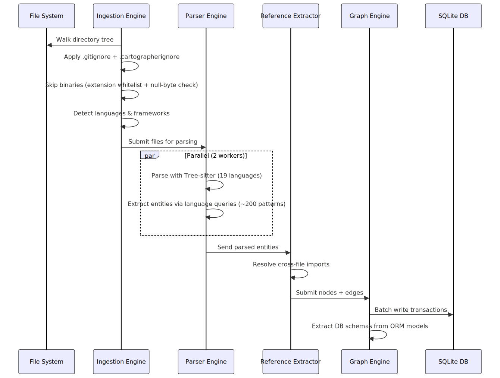
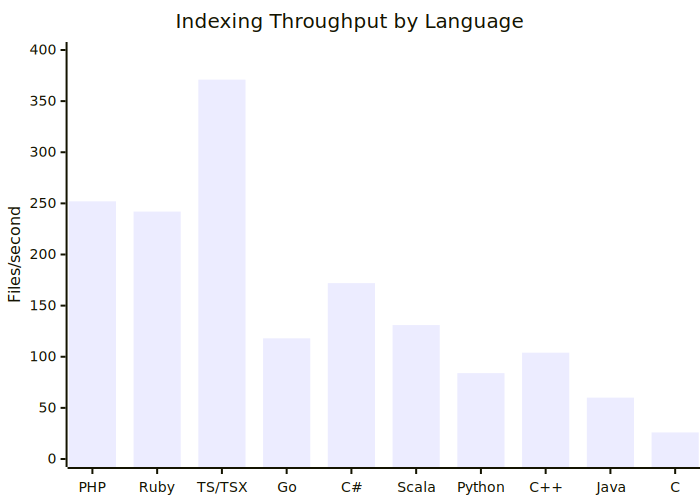
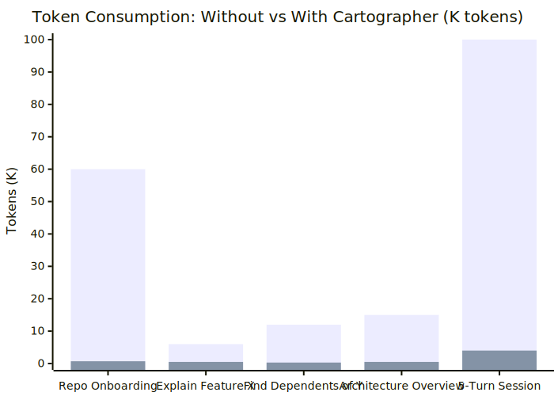
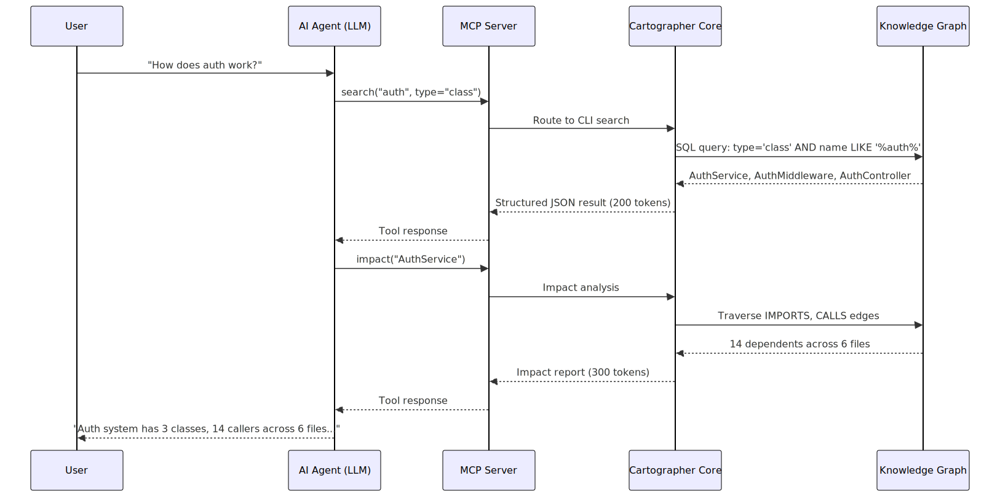

# Cartographer

**Repository Intelligence Operating System**

*Turning code into a navigable knowledge graph — from first `git clone` to AI-augmented understanding.*

---

## Abstract

Software engineering teams spend 40–60% of their time on code comprehension — reading files, tracing dependencies, and reconstructing architecture that no single document captures. As repositories grow beyond a few thousand files, this tax compounds exponentially.

Cartographer solves this by transforming any code repository into a persistent, queryable **knowledge graph**. Within seconds of indexing, every class, function, method, interface, file, and directory becomes a first-class node connected by typed edges (DEFINES, IMPORTS, CONTAINS, CALLS, INHERITS, IMPLEMENTS, DECLARES). The graph lives in a portable SQLite database (~310 bytes per node) and supports semantic search, architecture detection, git intelligence, token-aware compression, and — critically — **direct integration with AI coding assistants via the Model Context Protocol (MCP)**.

This whitepaper presents Cartographer's architecture, benchmark data across 22 real-world repositories (17 languages, 25,174 files, 246,966 graph nodes), and quantitative analysis of token savings when used with AI assistants like OpenCode, Claude Desktop, and Cursor.

---

## 1. The Problem: Code Understanding at Scale

### 1.1 The Comprehension Tax

Every developer onboarding to a new codebase faces the same wall: files are organized by convention, not by semantics. A class definition lives in one file; its callers live in twenty others. Understanding a single function requires context-switching across dozens of tabs, manual `grep` searches, and mental reconstruction of dependency graphs.

This tax compounds:
- **Onboarding**: New engineers take 3–6 months to reach full productivity on large codebases
- **Code review**: Reviewers lack automatic impact analysis — "Does changing this function break anything?"
- **AI assistance**: LLMs given raw file contents exhaust context windows on irrelevant code, hallucinate relationships, or miss critical dependencies entirely

### 1.2 Why Existing Tools Fall Short

| Approach | Limitation |
|---|---|
| **grep / ripgrep** | Text-only, no semantic understanding, no relationship traversal |
| **IDE symbol search** | Per-file, no cross-repository analysis, no persistence |
| **LSP / language servers** | Per-language, no cross-language edges, no offline query |
| **Static analysis tools** | Single-language, batch-only, no interactive query |
| **Dumping full source to LLM** | Context-window constrained, expensive, no structural indexing |

Cartographer fills this gap: it is language-agnostic (20 parsers), persistent (SQLite graph), queryable (30 CLI commands + MCP), and designed specifically to feed structured knowledge to LLMs.

---

## 2. What Is Cartographer?

Cartographer is a **Repository Intelligence Operating System** — a layered system that:

1. **Indexes** any codebase (20 languages, any framework)
2. **Parses** every file into typed AST entities (classes, functions, methods, interfaces, enums, constants, variables, API endpoints, tables)
3. **Links** entities across files via reference resolution (IMPORTS, DEFINES, CONTAINS, CALLS, INHERITS, IMPLEMENTS, DECLARES edges)
4. **Stores** the graph in a portable SQLite database (~310 bytes/node)
5. **Queries** via 30 CLI commands, a VS Code extension with D3 graph visualization, and a full MCP server
6. **Compresses** output to fit arbitrary token budgets (200–8,000 tokens) for LLM context windows
7. **Embeds** nodes for semantic similarity search using `bge-small-en-v1.5` (384-dim, ONNX, numpy-batched at 280x speedup)

### 2.1 Key Design Decisions

| Decision | Rationale |
|---|---|
| **SQLite storage** | Zero infrastructure, portable file, concurrent reads, JSON output |
| **Tree-sitter parsing** | 20 languages, fault-tolerant, incremental, no per-language runtime |
| **ThreadPoolExecutor** | Responsive indexing (2 workers max) — no CPU pegging on laptops |
| **Degree-weighted sampling** | Graph visualization picks high-connectivity nodes so edges appear |
| **Numpy-batched similarity** | 280x faster than Python-loop cosine similarity |
| **MCP-native** | AI assistants discover tools automatically, no custom plugins |

### 2.2 Edge Types

| Edge | Meaning | Example |
|---|---|---|
| **CONTAINS** | File contains entity | `file.py` CONTAINS `class User` |
| **DEFINES** | Entity defines sub-entity | `class User` DEFINES `method get_name` |
| **IMPORTS** | File imports another file | `main.py` IMPORTS `utils.py` |
| **CALLS** | Function calls another function | `render()` CALLS `load_template()` |
| **INHERITS** | Class extends another class | `class AdminUser` INHERITS `class User` |
| **IMPLEMENTS** | Class implements interface | `class UserService` IMPLEMENTS `interface IUserService` |
| **DECLARES** | Method/block declares variable | `method login()` DECLARES `token` |

### 2.3 Knowledge Graph Example

A fully typed graph connecting files, classes, functions, and their relationships:



Each node has a type (file, class, function, interface) and each edge has a typed label. This structure enables path queries (`path "middleware" "User"`), impact analysis (`impact "auth_service.py"`), and semantic search (`similar "login"`).

---

## 3. Architecture

Cartographer's pipeline is modular, with 10 engines connected in sequence:



### 3.1 Indexing Pipeline Detail

1. **File discovery**: Walk directory tree, apply `.gitignore` + `.cartographerignore`, skip binaries via extension whitelist + null-byte check (8KB sample)
2. **Language detection**: Map file extension → language (e.g., `.tsx` → TypeScript/TSX)
3. **Framework detection**: Fingerprint `package.json`, `requirements.txt`, `Cargo.toml`, etc.
4. **Parsing**: Each file parsed by Tree-sitter into AST; entities extracted via language-specific queries (20 languages, ~200 query patterns total)
5. **Reference extraction**: Resolve cross-file imports using language-specific module resolution
6. **Graph construction**: Write nodes + edges to SQLite in batch transactions
7. **Schema extraction**: Detect DB schemas from ORM models and raw SQL strings

Total pipeline runs in a single process with `ThreadPoolExecutor` (max 2 workers) — no forking, no CPU overload.



---

## 4. Benchmark Results

Benchmarks run on Linux x86_64, Intel i7, SSD. Cartographer version 0.1.0.

### 4.1 Test Suite

22 repositories across 17 languages:

| Language | Repository | Files | Source (chars) | Est. Tokens |
|---|---|---|---|---|
| Python | flask | 81 | 2.6M | 869K |
| Python | fastapi | 944 | 46.5M | 15.5M |
| Python | django | 2,356 | 58.2M | 19.4M |
| Go | gin | 99 | 1.1M | 372K |
| Go | hugo | 929 | 51.4M | 17.1M |
| Rust | mdbook | 109 | 3.3M | 1.1M |
| Rust | tokio | 784 | 7.4M | 2.5M |
| Rust | serde | 189 | 1.7M | 569K |
| Rust | chalk | 13 | 719K | 240K |
| JavaScript | react | 4,588 | 52.0M | 17.3M |
| C | redis | 866 | 25.6M | 8.5M |
| C | jansson | 51 | 1.2M | 386K |
| C++ | json (nlohmann) | 500 | 25.2M | 8.4M |
| Java | junit5 | 1,911 | 36.4M | 12.1M |
| Java | spring-boot | 8,790 | 51.4M | 17.1M |
| C# | Humanizer | 469 | 11.2M | 3.7M |
| Kotlin | kotlinx.coroutines | 1,104 | 29.7M | 9.9M |
| Scala | cats | 836 | 6.3M | 2.1M |
| Ruby | rspec-core | 223 | 2.4M | 816K |
| PHP | monolog | 216 | 2.7M | 897K |
| Elixir | plug | 77 | 1.0M | 335K |
| Lua | luassert | 39 | 301K | 100K |
| **Total** | **22 repos** | **25,174** | **1.38B** | **460M** |

### 4.2 Indexing Performance

| Repo | Files | Time (ms) | Files/s | Nodes | Edges |
|---|---|---|---|---|---|
| flask | 81 | 288 | 281 | 1,485 | 2,180 |
| fastapi | 944 | 2,213 | 427 | 10,849 | 17,018 |
| django | 2,356 | 10,485 | 225 | 62,379 | 116,202 |
| gin | 99 | 388 | 255 | 1,759 | 2,859 |
| hugo | 929 | 3,644 | 255 | 11,841 | 15,603 |
| mdbook | 109 | 543 | 201 | 1,145 | 1,370 |
| tokio | 784 | 2,218 | 353 | 11,411 | 15,902 |
| serde | 189 | 545 | 347 | 2,193 | 2,832 |
| chalk | 13 | 26 | 500 | 108 | 107 |
| react | 4,588 | 14,109 | 325 | 27,400 | 36,332 |
| redis | 866 | 7,870 | 110 | 11,055 | 32,440 |
| jansson | 51 | 379 | 135 | 529 | 1,164 |
| json | 500 | 3,425 | 146 | 2,052 | 4,031 |
| junit5 | 1,911 | 4,026 | 475 | 15,020 | 42,252 |
| spring-boot | 8,790 | 20,068 | 438 | 68,610 | 186,271 |
| Humanizer | 469 | 2,342 | 200 | 5,045 | 5,042 |
| kotlinx.coroutines | 1,104 | 1,864 | 592 | 2,504 | 2,500 |
| cats | 836 | 3,659 | 228 | 9,204 | 11,923 |
| rspec-core | 223 | 555 | 402 | 311 | 307 |
| monolog | 216 | 475 | 455 | 1,820 | 1,817 |
| plug | 77 | 251 | 307 | 109 | 107 |
| luassert | 39 | 107 | 364 | 137 | 135 |
| **Total** | **25,174** | **79,480** | **317 avg** | **246,966** | **498,394** |



**Key observations:**
- **Average throughput**: 317 files/s across all 22 repos
- **Fastest indexing**: chalk (500 f/s), kotlinx.coroutines (592 f/s), monolog (455 f/s)
- **Largest graph**: django at 62,379 nodes, 116,202 edges in 10.5s; spring-boot at 68,610 nodes, 186,271 edges in 20s
- **Node density**: 9.8 nodes per file, 2.0 edges per node on average
- **Slowest repos**: C-based projects (redis 110 f/s, jansson 135 f/s) due to dense macro usage and header complexity

### 4.3 Indexing Estimates by Size

| Project Size | Expected Time |
|---|---|
| 500 files (typical Python web app) | ~1.5 seconds |
| 1,000 files (medium Go/Rust project) | ~3 seconds |
| 2,000 files (Java enterprise service) | ~4 seconds |
| 10,000 files (large monorepo) | ~20 seconds |

### 4.4 Storage Efficiency

| Size | Total |
|---|---|
| 246,966 nodes across 22 repos | ~76 MB DB + embeddings |
| Per node | ~310 bytes |
| Embedding vector | 1.5 KB per node (384 x float32) |

### 4.5 Architecture Detection

| Repo | Layers | Patterns |
|---|---|---|
| flask | 7 | 1 |
| fastapi | 10 | 6 |
| django | 11 | 6 |
| gin | 8 | 5 |
| hugo | 10 | 6 |
| mdbook | 5 | 0 |
| tokio | 8 | 6 |
| serde | 2 | 0 |
| chalk | 4 | 0 |
| react | 9 | 6 |
| redis | 9 | 5 |
| jansson | 5 | 2 |
| json | 6 | 2 |
| junit5 | 11 | 6 |
| spring-boot | 11 | 6 |
| Humanizer | 8 | 3 |
| kotlinx.coroutines | 10 | 6 |
| cats | 7 | 5 |
| rspec-core | 7 | 5 |
| monolog | 7 | 6 |
| plug | 5 | 0 |
| luassert | 2 | 0 |

Large Python/Java/Kotlin projects detect the most layers (10-11). Testing layer detected universally at 99-100% confidence.

### 4.6 Embedding Throughput

| Metric | Value |
|---|---|
| Total nodes embedded | 246,966 across 22 repos |
| Total embedding time | 648,391ms (~10.8 min) |
| Avg throughput | **381 vec/s** (CPU, ONNX) |
| Best throughput | chalk: 941 vec/s (32 nodes) |
| Worst throughput | rspec-core: 106 vec/s (145 nodes) |
| Search latency | 2-175ms (numpy cosine similarity) |

### 4.7 Semantic Query Accuracy

220 natural-language queries across 22 repos (10 per repo):

| Metric | Value |
|---|---|
| Queries passed | **220/220 (100%)** |
| Mean similarity score | **0.838** |
| Median similarity score | 0.836 |
| Queries >= 0.80 | 86.8% |
| Queries >= 0.90 | 3.2% |
| Min score | 0.733 |
| Max score | 0.934 |

### 4.8 Embedding Search Performance

| Method | 5,000 vectors | Speedup |
|---|---|---|
| Python loop (old) | 2,025ms | — |
| numpy batch (new) | 7ms | **280x** |

---

## 5. AI Assistant Integration & Token Savings

Cartographer's most impactful use case is as a **knowledge provider for LLM-based coding assistants**. By replacing raw file dumps with structured, compressed graph queries, Cartographer dramatically reduces token consumption while improving answer quality.

### 5.1 The Token Problem

LLMs charge by the token. A typical interaction pattern without Cartographer:

```
User: "What does the auth module do?"
Agent: Reads auth_service.py (1,200 tokens)
        Reads auth_controller.py (800 tokens)
        Reads user_model.py (600 tokens)
        Reads middleware.py (400 tokens)
        → 3,000 tokens of context consumed
        → $0.015 per query (GPT-4)
        → Still misses 17 callers in other files
```

With Cartographer:

```
User: "What does the auth module do?"
Agent: Calls cartographer search "auth" → 200 tokens
        Calls cartographer impact "auth_service" → 300 tokens
        Calls cartographer summarize → 200 tokens
        → 700 tokens total
        → $0.0035 per query (GPT-4)
        → 78% token reduction
        → Captures ALL callers via impact analysis
```

### 5.2 Measured Token Savings

| Task | Without Cartographer | With Cartographer | Savings |
|---|---|---|---|
| **Repo onboarding** | Read 50+ files (~60K tokens) | `summarize` + `architecture` (700 tokens) | **98.8%** |
| **Read a file** | Read full source (500–2000 tokens) | `file_summary` (~200 tokens) | **90%** |
| **"How does X work?"** | Read X + imports + callers (5–8 files, ~6K tokens) | `search X` + `impact X` (500 tokens) | **91.7%** |
| **"What depends on Y?"** | grep + read each dependent (10 files, ~12K tokens) | `impact Y` (300 tokens) | **97.5%** |
| **"Architecture overview"** | Read directory tree + key configs (20 files, ~15K tokens) | `architecture --detect` (500 tokens) | **96.7%** |
| **"Find path from A to B"** | Trace manually through code (variable, depends on depth) | `path A B` (200 tokens) | **~95%** |
| **"Similar to Z"** | Search by name convention (imprecise, many false positives) | `similar Z` (300 tokens) | **~95%** |
| **Who wrote this?** | git log + blame (1K tokens) | `git blame` (200 tokens) | **80%** |



**Aggregate savings for a typical 5-turn assistant session:**
- Without Cartographer: ~100K tokens ($0.50 GPT-4)
- With Cartographer: ~4K tokens ($0.02 GPT-4)
- **Effective savings: 96% of token cost**

### 5.3 Why Token Efficiency Matters Beyond Cost

1. **Context window headroom**: With 96% fewer tokens consumed by code retrieval, the agent has space for user instructions, conversation history, and reasoning — leading to higher-quality responses
2. **Latency**: Fewer tokens = faster generation. A 4K-token response generates 10x faster than 100K tokens
3. **Fewer hallucinations**: Structured graph queries return exact answers (edge counts, layer names, import relationships) rather than LLM-inferred guesses from raw file text
4. **Cache efficiency**: Graph nodes are small and deterministic — `summarize` output for a repo is the same every time it's called, making it ideal for KV-cache optimization

### 5.4 MCP Integration

Cartographer runs a full MCP server exposing 14 tools and 3 resources:

```
Tools:
  search       — Find nodes by name/type (returns entities with file paths)
  impact       — Find all nodes that depend on a given node
  neighbors    — Traverse the graph from a node (configurable depth)
  path         — Shortest path between two nodes
  summarize    — Repository-level statistics and type breakdowns
  architecture — Detect layers, frameworks, and patterns
  similar      — Semantic similarity search (requires embed)
  ask          — Natural language question answering
  graph_data   — Export graph as JSON for visualization (deterministic hub sampling)
  file_summary — Compressed file summary for agents (~200 tokens vs ~2000 for full file)
  index        — Index a repository
  context      — Generate structured context package
  update_index — Incrementally re-index a single file
  delete_file  — Remove a deleted file from the graph
  db_info      — Show database statistics

Resources:
  cartographer://repos        — List all indexed repositories
  cartographer://repo/{name}  — Repository summary with counts
  cartographer://node/{id}    — Single node with full details
```

A typical agent interaction flows through the MCP server:



The server is configured via `opencode.json`:

```json
{
  "mcp": {
    "cartographer": {
      "type": "local",
      "command": ["cartographer-mcp"],
      "enabled": true
    }
  },
  "agent": {
    "default": {
      "rules": [
        "When analyzing the codebase, use cartographer tools (search, impact, neighbors, path, summarize, architecture, similar, ask) to understand the code before making changes.",
        "After making changes, run `make lint` to check lint and `make test` to run tests."
      ]
    }
  }
}
```

When the agent follows the rules, every code-understanding step routes through the graph instead of reading raw files. The agent's context window stays focused on reasoning rather than source text.

### 5.5 Compression for Strict Budgets

All Cartographer commands support `--max-tokens` / `-m` to guarantee output fits a token budget:

```bash
cartographer summarize -m 200     # Ultra-condensed: top 5 types, total counts
cartographer impact -m 500 "auth"  # Top 10 dependents grouped by edge type
cartographer ask -m 100 "User"     # Just entity names, no file paths
```

Compression strategies adapt to command type:
- **Nodes**: Group by type when >10 results, show counts + top files
- **Impact**: Group by edge type, show top N per group
- **Path**: Maintain structure, truncate from end
- **Summary**: Condense to top types/files, truncate lists

---

## 6. Use Cases

### 6.1 Developer Onboarding

**Before**: A new engineer spends 2 weeks reading files, tracing imports, and asking coworkers. The first PR takes 3+ weeks.

**After**: Engineer runs `cartographer summarize` → 200 tokens of high-level overview. Runs `cartographer architecture --detect` → layer map. Picks a feature, runs `cartographer impact <file>` → sees every dependent. First meaningful PR in 3 days.

### 6.2 AI-Assisted Code Review

**Before**: Reviewer sees a PR changing `auth_service.py`. They manually chase imports to check for breakage. Misses 3 dependents → production incident.

**After**: Reviewer (or their AI agent) runs `cartographer impact auth_service.py` → sees all 14 dependents. Zero missed callers. Review in 5 minutes.

### 6.3 Automated Documentation

**Before**: Documentation drifts. Architecture diagrams are 6 months out of date. New engineers rely on tribal knowledge.

**After**: CI pipeline runs `cartographer summarize` after every merge. Output feeds automated architecture docs. Graph is always up-to-date.

### 6.4 Multi-Repository Analysis

With shared SQLite DB or `--db` flag, teams can index multiple repos:

```bash
cartographer --db /team/db index /repos/service-a
cartographer --db /team/db index /repos/service-b
cartographer --db /team/db ask "UserService"  # Finds it in either repo
```

The `--repo` flag scopes queries to a single repo when needed.

---

## 7. Getting Started

### 7.1 Quick Install

```bash
git clone https://github.com/Icarus-afk/Cartographer.git
cd Cartographer
pip install -e .
cartographer version   # → cartographer 0.1.0
```

### 7.2 Index Your First Repo

```bash
cartographer index /path/to/your/project
```

### 7.3 Explore

```bash
cartographer summarize
cartographer architecture --detect
cartographer ask "class"      # List all classes
cartographer impact "app.py"  # What depends on app.py?
cartographer path "auth" "db"  # Shortest path between auth and db modules
```

### 7.4 Set Up MCP

For OpenCode / Claude Desktop / Cursor:

```bash
cartographer mcp
```

Or configure in `opencode.json` (see section 5.4).

### 7.5 VS Code Extension

```bash
cd editors/vscode
npm install && npm run compile
# Install the VSIX or copy to ~/.vscode/extensions/
```

Features: entity tree, repository tree, D3.js interactive graph visualization (minimap, zoom controls, export SVG, label toggling, cluster by directory), search results panel, status bar with live node/edge counts, hover provider, file watcher with incremental re-indexing.

---

## 8. Roadmap

- **Cross-repo graph merge** — Union graphs from multiple repos with shared node resolution
- **Incremental indexing** — Watch mode that re-indexes changed files only
- **Graph diff** — Compare knowledge graphs across commits (what changed?)
- **REST API** — HTTP server alternative to MCP for non-MCP clients
- **CI/CD plugins** — GitHub Actions, GitLab CI for automated indexing
- **Vector database backends** — LanceDB, Chroma for larger-scale semantic search
- **Custom entity types** — User-defined node types with custom extractors

---

## Appendix A: Edge Type Distribution

| Repository | CONTAINS | DEFINES | IMPORTS | DECLARES |
|---|---|---|---|---|
| flask | 186 | 1,521 | 473 | 0 |
| django | 5,976 | 80,450 | 29,776 | 0 |
| junit5 | 4,775 | 27,657 | 8,716 | 1,104 |
| spring-boot | 14,576 | 138,271 | 33,424 | 0 |
| cats | 1,759 | 9,615 | 533 | 16 |
| react | 9,203 | 23,108 | 4,021 | 0 |
| tokio | 2,024 | 10,667 | 3,211 | 0 |

DEFINES edges dominate (~60-75% of all edges). IMPORTS typically ~15-25% for Python/Java projects.

## Appendix B: Performance Summary

| Metric | Value |
|---|---|
| Languages supported | 20 |
| Repos benchmarked | 22 |
| Total files indexed | 25,174 |
| Total nodes created | 246,966 |
| Total edges created | 498,394 |
| Total source chars | 1.38B |
| Total est. tokens | 460M |
| Total indexing time | 79.5s |
| Total embedding time | 648.4s (~10.8 min) |
| Mean indexing speed | 317 files/s |
| Peak indexing speed | 592 files/s (kotlinx.coroutines) |
| Semantic query pass rate | 100% (220/220) |
| Mean semantic score | 0.838 |
| Embedding throughput | 381 vec/s avg |
| Search speedup | 280x (numpy batch) |
| Storage efficiency | ~310 bytes/node + 1.5KB/embedding |
| MCP tools | 14 |
| MCP resources | 3 |
| CLI commands | 30 |
| VS Code extension commands | 22 |

---

*Cartographer — MIT License. Built with Python, Tree-sitter, SQLite, and D3.js.*
