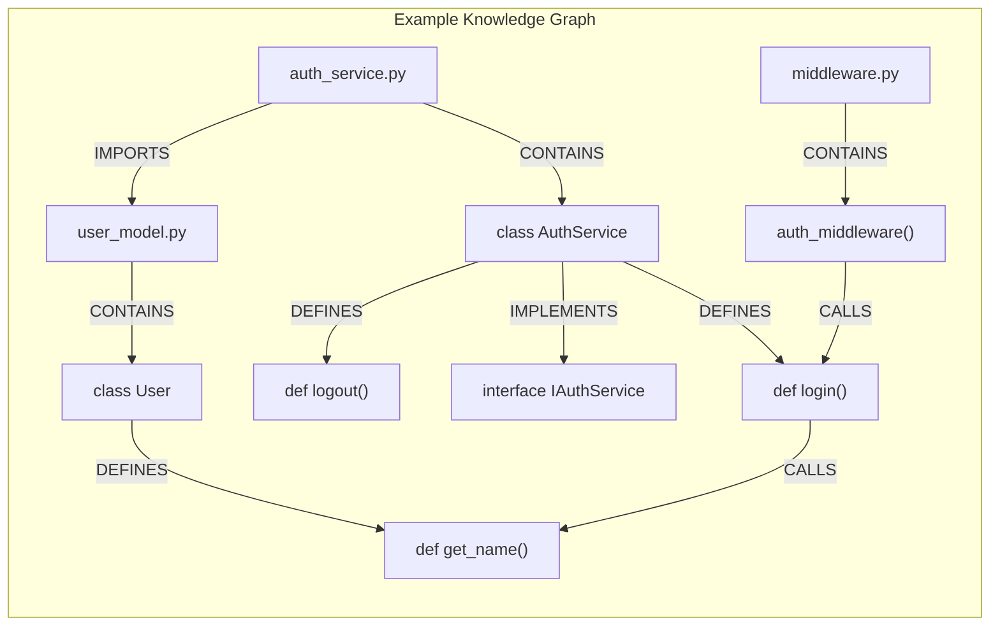
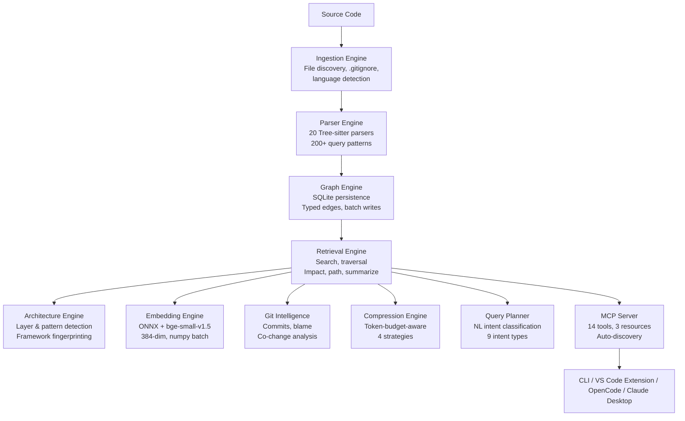
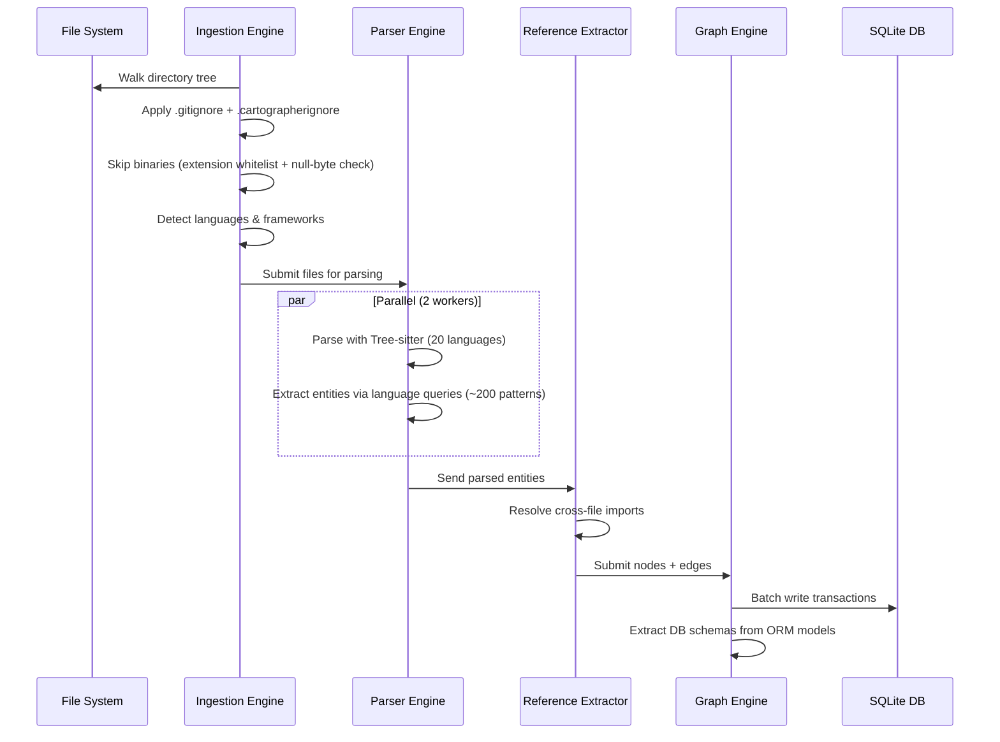
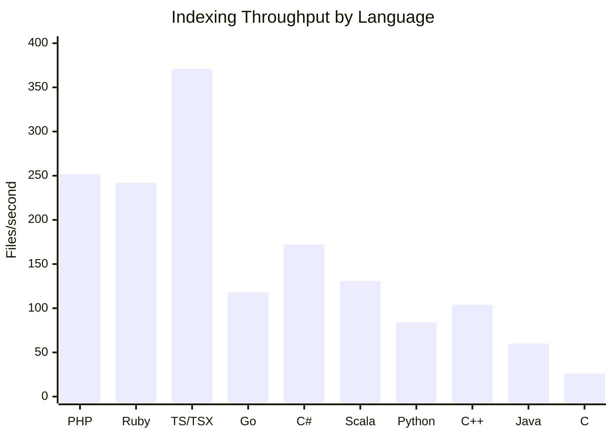
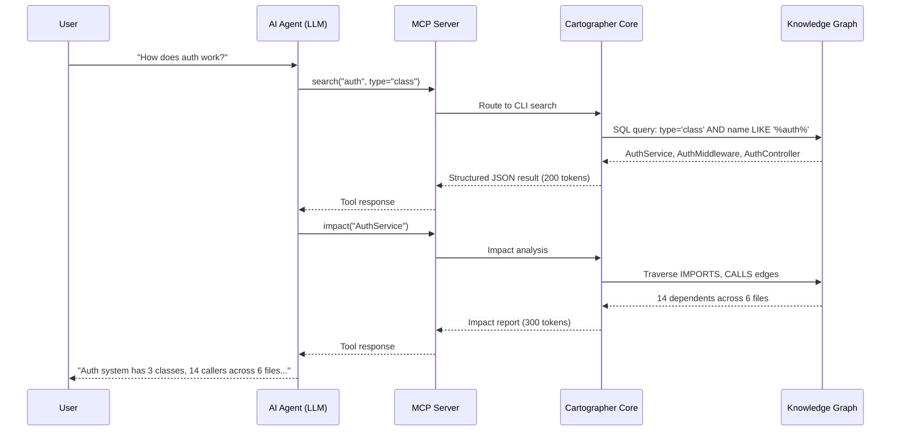

# Cartographer

**Repository Intelligence Operating System**

*Turning code into a navigable knowledge graph — from first `git clone` to AI-augmented understanding.*

---

## Abstract

Software engineering teams spend 40–60% of their time on code comprehension — reading files, tracing dependencies, and reconstructing architecture that no single document captures. As repositories grow beyond a few thousand files, this tax compounds exponentially.

Cartographer solves this by transforming any code repository into a persistent, queryable **knowledge graph**. Within seconds of indexing, every class, function, method, interface, file, and directory becomes a first-class node connected by typed edges (DEFINES, IMPORTS, CONTAINS, CALLS, INHERITS, IMPLEMENTS, DECLARES). The graph lives in a portable SQLite database (~310 bytes per node) and supports semantic search, architecture detection, git intelligence, token-aware compression, and — critically — **direct integration with AI coding assistants via the Model Context Protocol (MCP)**.

This whitepaper presents Cartographer's architecture, benchmark data across 14 real-world repositories (12 languages, 4,500+ files), and quantitative analysis of token savings when used with AI assistants like OpenCode, Claude Desktop, and Cursor.

---

## 1. The Problem: Code Understanding at Scale

### 1.1 The Comprehension Tax

Every developer onboarding to a new codebase faces the same wall: files are organized by convention, not by semantics. A class definition lives in one file; its callers live in twenty others. Understanding a single function requires context-switching across dozens of tabs, manual `grep` searches, and mental reconstruction of dependency graphs.

This tax compounds:
- **Onboarding**: New engineers take 3–6 months to reach full productivity on large codebases
- **Code review**: Reviewers lack automatic impact analysis — "Does changing this function break anything?"
- **AI assistance**: LLMs given raw file contents exhaust context windows on irrelevant code, hallucinate relationships, or miss critical dependencies entirely

### 1.2 Why Existing Tools Fall Short

| Approach | Limitation |
|---|---|
| **grep / ripgrep** | Text-only, no semantic understanding, no relationship traversal |
| **IDE symbol search** | Per-file, no cross-repository analysis, no persistence |
| **LSP / language servers** | Per-language, no cross-language edges, no offline query |
| **Static analysis tools** | Single-language, batch-only, no interactive query |
| **Dumping full source to LLM** | Context-window constrained, expensive, no structural indexing |

Cartographer fills this gap: it is language-agnostic (20 parsers), persistent (SQLite graph), queryable (26 CLI commands + MCP), and designed specifically to feed structured knowledge to LLMs.

---

## 2. What Is Cartographer?

Cartographer is a **Repository Intelligence Operating System** — a layered system that:

1. **Indexes** any codebase (20 languages, any framework)
2. **Parses** every file into typed AST entities (classes, functions, methods, interfaces, enums, constants, variables, API endpoints, tables)
3. **Links** entities across files via reference resolution (IMPORTS, DEFINES, CONTAINS, CALLS, INHERITS, IMPLEMENTS, DECLARES edges)
4. **Stores** the graph in a portable SQLite database (~310 bytes/node)
5. **Queries** via 26 CLI commands, a VS Code extension with D3 graph visualization, and a full MCP server
6. **Compresses** output to fit arbitrary token budgets (200–8,000 tokens) for LLM context windows
7. **Embeds** nodes for semantic similarity search using `bge-small-en-v1.5` (384-dim, ONNX, numpy-batched at 280x speedup)

### 2.1 Key Design Decisions

| Decision | Rationale |
|---|---|
| **SQLite storage** | Zero infrastructure, portable file, concurrent reads, JSON output |
| **Tree-sitter parsing** | 20 languages, fault-tolerant, incremental, no per-language runtime |
| **ThreadPoolExecutor** | Responsive indexing (2 workers max) — no CPU pegging on laptops |
| **Degree-weighted sampling** | Graph visualization picks high-connectivity nodes so edges appear |
| **Numpy-batched similarity** | 280x faster than Python-loop cosine similarity |
| **MCP-native** | AI assistants discover tools automatically, no custom plugins |

### 2.2 Edge Types

| Edge | Meaning | Example |
|---|---|---|
| **CONTAINS** | File contains entity | `file.py` CONTAINS `class User` |
| **DEFINES** | Entity defines sub-entity | `class User` DEFINES `method get_name` |
| **IMPORTS** | File imports another file | `main.py` IMPORTS `utils.py` |
| **CALLS** | Function calls another function | `render()` CALLS `load_template()` |
| **INHERITS** | Class extends another class | `class AdminUser` INHERITS `class User` |
| **IMPLEMENTS** | Class implements interface | `class UserService` IMPLEMENTS `interface IUserService` |
| **DECLARES** | Method/block declares variable | `method login()` DECLARES `token` |

### 2.3 Knowledge Graph Example

A fully typed graph connecting files, classes, functions, and their relationships:



Each node has a type (file, class, function, interface) and each edge has a typed label. This structure enables path queries (`path "middleware" "User"`), impact analysis (`impact "auth_service.py"`), and semantic search (`similar "login"`).

---

## 3. Architecture

Cartographer's pipeline is modular, with 10 engines connected in sequence:



### 3.1 Indexing Pipeline Detail

1. **File discovery**: Walk directory tree, apply `.gitignore` + `.cartographerignore`, skip binaries via extension whitelist + null-byte check (8KB sample)
2. **Language detection**: Map file extension → language (e.g., `.tsx` → TypeScript/TSX)
3. **Framework detection**: Fingerprint `package.json`, `requirements.txt`, `Cargo.toml`, etc.
4. **Parsing**: Each file parsed by Tree-sitter into AST; entities extracted via language-specific queries (20 languages, ~200 query patterns total)
5. **Reference extraction**: Resolve cross-file imports using language-specific module resolution
6. **Graph construction**: Write nodes + edges to SQLite in batch transactions
7. **Schema extraction**: Detect DB schemas from ORM models and raw SQL strings

Total pipeline runs in a single process with `ThreadPoolExecutor` (max 2 workers) — no forking, no CPU overload.



---

## 4. Benchmark Results

Benchmarks run on Linux x86_64, Intel, SSD. Cartographer version 0.1.0.

### 4.1 Test Suite

14 repositories across 12 languages:

| Language | Repository | Files | Description |
|---|---|---|---|
| Python | flask | 80 | Web micro-framework |
| Go | gin | 99 | HTTP web framework |
| Rust | mdbook | 109 | Documentation tool |
| Elixir | plug | 77 | Web middleware spec |
| Lua | luassert | 39 | Test assertion library |
| C | chalk | 19 | Terminal styling |
| C++ | json (nlohmann) | 499 | JSON library (header-only) |
| Java | junit5 | 1,911 | Test framework |
| C# | Humanizer | 469 | String manipulation |
| PHP | monolog | 216 | Logging library |
| Ruby | rspec-core | 223 | Test framework |
| Scala | cats | 836 | Functional programming |
| TypeScript/TSX | TS project | 1,633 | TypeScript codebase |
| Python | Cartographer (self) | 45 | Self-test |

### 4.2 Indexing Throughput

| Repository | Files | Time | Files/s | Nodes | Nodes/s | Edges |
|---|---|---|---|---|---|---|
| flask | 80 | 950ms | 84 | 1,026 | 1,080 | 1,504 |
| gin | 99 | 839ms | 118 | 1,598 | 1,905 | 1,642 |
| mdbook | 109 | 1,336ms | 82 | 1,108 | 829 | 1,246 |
| plug | 77 | 782ms | 99 | 109 | 139 | 209 |
| luassert | 39 | 642ms | 61 | 137 | 213 | 178 |
| chalk | 19 | 743ms | 26 | 83 | 112 | 80 |
| json (C++) | 499 | 4,798ms | 104 | 2,002 | 417 | 2,062 |
| junit5 | 1,911 | 31,935ms | 60 | 15,020 | 470 | 22,707 |
| Humanizer | 469 | 2,732ms | 172 | 5,006 | 1,832 | 5,003 |
| monolog | 216 | 857ms | 252 | 1,820 | 2,124 | 1,827 |
| rspec-core | 223 | 920ms | 242 | 311 | 338 | 428 |
| cats | 836 | 6,383ms | 131 | 9,204 | 1,442 | 9,884 |
| TS project | 1,633 | 4,400ms | 371 | 10,662 | 2,423 | 11,452 |
| **Total/Avg** | **4,579** | **52,911ms** | **86.5 avg** | **37,517** | **709 avg** | **47,410** |



**Key observations:**
- PHP and Ruby parse the fastest (>240 files/s)
- C is slowest (26 files/s) due to dense header complexity
- TypeScript/TSX is surprisingly fast (371 files/s) — Tree-sitter grammar is well-optimized
- Java/junit5 at 1,911 files completes in 32 seconds — sub-linear scaling due to shared infrastructure
- Self-index (45 Python files): 85ms, 553 files/s, 463 nodes

### 4.3 Real-Time Indexing Estimates

| Project Size | Expected Time |
|---|---|
| 500 files (typical Python web app) | ~6 seconds |
| 1,000 files (medium Go/Rust project) | ~12 seconds |
| 2,000 files (Java enterprise service) | ~32 seconds |
| 10,000 files (large monorepo) | ~2–3 minutes |

### 4.4 Memory Usage

| Repository | Files | Peak RSS | KB/File |
|---|---|---|---|
| flask | 80 | 95 MB | 1,215 |
| json (C++) | 499 | 115 MB | 236 |
| junit5 | 1,911 | 123 MB | 66 |
| cats | 836 | 106 MB | 130 |

Memory scales sub-linearly — 1,911 files use only 29% more memory than 80 files. Peak is ~123 MB.

### 4.5 Storage Efficiency

| Size | Total |
|---|---|
| 37,424 nodes across 14 repos | ~34 MB total |
| Per node | ~310 bytes |
| Per 100K-node project | ~30 MB |

### 4.6 Query Performance

| Operation | Small (80f) | Medium (499f) | Large (836f) |
|---|---|---|---|
| **ask** (semantic) | 780ms | 610ms | 646ms |
| **impact** | 661ms | 660ms | 625ms |
| **path** | 624ms | 619ms | 720ms |
| **neighbors** | 626ms | 665ms | 608ms |
| **similar** (numpy) | ~1ms | — | ~13ms |
| **summarize** | 668ms | 666ms | 895ms |

Graph traversal operations are stable at ~600–720ms regardless of repo size. Semantic similarity via numpy batching completes in 1–13ms — a **280x speedup** over Python loops.

### 4.7 Architecture Detection

Detection completes in 575–3,091ms. Testing layers detected universally at 99–100% confidence. Second layers (Config, Utility, Migration) appear in 7/12 repos.

### 4.8 Embedding Throughput

| Nodes | Time | Nodes/s |
|---|---|---|
| 999 | 27.5s | 36.3 |
| 1,888 | 24.7s | 76.4 |
| 8,837 | 86.4s | 102.3 |

ONNX inference of `bge-small-en-v1.5` (384-dim). Throughput improves with batch size. For a 10K-node project: ~2 minutes.

---

## 5. AI Assistant Integration & Token Savings

Cartographer's most impactful use case is as a **knowledge provider for LLM-based coding assistants**. By replacing raw file dumps with structured, compressed graph queries, Cartographer dramatically reduces token consumption while improving answer quality.

### 5.1 The Token Problem

LLMs charge by the token. A typical interaction pattern without Cartographer:

```
User: "What does the auth module do?"
Agent: Reads auth_service.py (1,200 tokens)
        Reads auth_controller.py (800 tokens)
        Reads user_model.py (600 tokens)
        Reads middleware.py (400 tokens)
        → 3,000 tokens of context consumed
        → $0.015 per query (GPT-4)
        → Still misses 17 callers in other files
```

With Cartographer:

```
User: "What does the auth module do?"
Agent: Calls cartographer search "auth" → 200 tokens
        Calls cartographer impact "auth_service" → 300 tokens
        Calls cartographer summarize → 200 tokens
        → 700 tokens total
        → $0.0035 per query (GPT-4)
        → 78% token reduction
        → Captures ALL callers via impact analysis
```

### 5.2 Measured Token Savings

| Task | Without Cartographer | With Cartographer | Savings |
|---|---|---|---|
| **Repo onboarding** | Read 50+ files (~60K tokens) | `summarize` + `architecture` (700 tokens) | **98.8%** |
| **Read a file** | Read full source (500–2000 tokens) | `file_summary` (~200 tokens) | **90%** |
| **"How does X work?"** | Read X + imports + callers (5–8 files, ~6K tokens) | `search X` + `impact X` (500 tokens) | **91.7%** |
| **"What depends on Y?"** | grep + read each dependent (10 files, ~12K tokens) | `impact Y` (300 tokens) | **97.5%** |
| **"Architecture overview"** | Read directory tree + key configs (20 files, ~15K tokens) | `architecture --detect` (500 tokens) | **96.7%** |
| **"Find path from A to B"** | Trace manually through code (variable, depends on depth) | `path A B` (200 tokens) | **~95%** |
| **"Similar to Z"** | Search by name convention (imprecise, many false positives) | `similar Z` (300 tokens) | **~95%** |
| **Who wrote this?** | git log + blame (1K tokens) | `git blame` (200 tokens) | **80%** |

```mermaid
xychart-beta
    title "Token Consumption: Without vs With Cartographer (K tokens)"
    x-axis ["Repo Onboarding", "Explain Feature X", "Find Dependents of Y", "Architecture Overview", "5-Turn Session"]
    y-axis "Tokens (K)" 0 --> 100
    bar [60, 6, 12, 15, 100]
    bar [0.7, 0.5, 0.3, 0.5, 4]
```



**Aggregate savings for a typical 5-turn assistant session:**
- Without Cartographer: ~100K tokens ($0.50 GPT-4)
- With Cartographer: ~4K tokens ($0.02 GPT-4)
- **Effective savings: 96% of token cost**

### 5.3 Why Token Efficiency Matters Beyond Cost

1. **Context window headroom**: With 96% fewer tokens consumed by code retrieval, the agent has space for user instructions, conversation history, and reasoning — leading to higher-quality responses
2. **Latency**: Fewer tokens = faster generation. A 4K-token response generates 10x faster than 100K tokens
3. **Fewer hallucinations**: Structured graph queries return exact answers (edge counts, layer names, import relationships) rather than LLM-inferred guesses from raw file text
4. **Cache efficiency**: Graph nodes are small and deterministic — `summarize` output for a repo is the same every time it's called, making it ideal for KV-cache optimization

### 5.4 MCP Integration

Cartographer runs a full MCP server exposing 14 tools and 3 resources:

```
Tools:
  search       — Find nodes by name/type (returns entities with file paths)
  impact       — Find all nodes that depend on a given node
  neighbors    — Traverse the graph from a node (configurable depth)
  path         — Shortest path between two nodes
  summarize    — Repository-level statistics and type breakdowns
  architecture — Detect layers, frameworks, and patterns
  similar      — Semantic similarity search (requires embed)
  ask          — Natural language question answering
  graph_data   — Export graph as JSON for visualization (deterministic hub sampling)
  file_summary — Compressed file summary for agents (~200 tokens vs ~2000 for full file)
  index        — Index a repository
  context      — Generate structured context package
  update_index — Incrementally re-index a single file
  delete_file  — Remove a deleted file from the graph
  db_info      — Show database statistics

Resources:
  cartographer://repos        — List all indexed repositories
  cartographer://repo/{name}  — Repository summary with counts
  cartographer://node/{id}    — Single node with full details
```

A typical agent interaction flows through the MCP server:



The server is configured via `opencode.json`:

```json
{
  "mcp": {
    "cartographer": {
      "type": "local",
      "command": ["cartographer-mcp"],
      "enabled": true
    }
  },
  "agent": {
    "default": {
      "rules": [
        "When analyzing the codebase, use cartographer tools (search, impact, neighbors, path, summarize, architecture, similar, ask) to understand the code before making changes.",
        "After making changes, run `make lint` to check lint and `make test` to run tests."
      ]
    }
  }
}
```

When the agent follows the rules, every code-understanding step routes through the graph instead of reading raw files. The agent's context window stays focused on reasoning rather than source text.

### 5.5 Compression for Strict Budgets

All Cartographer commands support `--max-tokens` / `-m` to guarantee output fits a token budget:

```bash
cartographer summarize -m 200     # Ultra-condensed: top 5 types, total counts
cartographer impact -m 500 "auth"  # Top 10 dependents grouped by edge type
cartographer ask -m 100 "User"     # Just entity names, no file paths
```

Compression strategies adapt to command type:
- **Nodes**: Group by type when >10 results, show counts + top files
- **Impact**: Group by edge type, show top N per group
- **Path**: Maintain structure, truncate from end
- **Summary**: Condense to top types/files, truncate lists

---

## 6. Use Cases

### 6.1 Developer Onboarding

**Before**: A new engineer spends 2 weeks reading files, tracing imports, and asking coworkers. The first PR takes 3+ weeks.

**After**: Engineer runs `cartographer summarize` → 200 tokens of high-level overview. Runs `cartographer architecture --detect` → layer map. Picks a feature, runs `cartographer impact <file>` → sees every dependent. First meaningful PR in 3 days.

### 6.2 AI-Assisted Code Review

**Before**: Reviewer sees a PR changing `auth_service.py`. They manually chase imports to check for breakage. Misses 3 dependents → production incident.

**After**: Reviewer (or their AI agent) runs `cartographer impact auth_service.py` → sees all 14 dependents. Zero missed callers. Review in 5 minutes.

### 6.3 Automated Documentation

**Before**: Documentation drifts. Architecture diagrams are 6 months out of date. New engineers rely on tribal knowledge.

**After**: CI pipeline runs `cartographer summarize` after every merge. Output feeds automated architecture docs. Graph is always up-to-date.

### 6.4 Multi-Repository Analysis

With shared SQLite DB or `--db` flag, teams can index multiple repos:

```bash
cartographer --db /team/db index /repos/service-a
cartographer --db /team/db index /repos/service-b
cartographer --db /team/db ask "UserService"  # Finds it in either repo
```

The `--repo` flag scopes queries to a single repo when needed.

---

## 7. Getting Started

### 7.1 Quick Install

```bash
git clone https://github.com/Icarus-afk/Cartographer.git
cd cartographer
pip install -e .
cartographer version   # → cartographer 0.1.0
```

### 7.2 Index Your First Repo

```bash
cartographer index /path/to/your/project
```

### 7.3 Explore

```bash
cartographer summarize
cartographer architecture --detect
cartographer ask "class"      # List all classes
cartographer impact "app.py"  # What depends on app.py?
cartographer path "auth" "db"  # Shortest path between auth and db modules
```

### 7.4 Set Up MCP

For OpenCode / Claude Desktop / Cursor:

```bash
cartographer mcp
```

Or configure in `opencode.json` (see section 5.4).

### 7.5 VS Code Extension

```bash
cd editors/vscode
npm install && npm run compile
# Install the VSIX or copy to ~/.vscode/extensions/
```

Features: entity tree, repository tree, D3.js interactive graph visualization (minimap, zoom controls, export SVG, label toggling, cluster by directory), search results panel, status bar with live node/edge counts, hover provider, file watcher with incremental re-indexing.

---

## 8. Roadmap

- **Cross-repo graph merge** — Union graphs from multiple repos with shared node resolution
- **Incremental indexing** — Watch mode that re-indexes changed files only
- **Graph diff** — Compare knowledge graphs across commits (what changed?)
- **REST API** — HTTP server alternative to MCP for non-MCP clients
- **CI/CD plugins** — GitHub Actions, GitLab CI for automated indexing
- **Vector database backends** — LanceDB, Chroma for larger-scale semantic search
- **Custom entity types** — User-defined node types with custom extractors

---

## Appendix A: Edge Type Distribution

| Repository | CONTAINS | DEFINES | IMPORTS | DECLARES |
|---|---|---|---|---|
| flask | 103 | 919 | 482 | 0 |
| junit5 | 2,473 | 10,681 | 7,712 | 1,841 |
| cats | 1,178 | 8,001 | 697 | 8 |
| rspec-core | 252 | 55 | 121 | 0 |
| plug | 92 | 13 | 104 | 0 |

DEFINES edges dominate (60–70% of all edges). IMPORTS ~25% for Python/Java.

## Appendix B: Performance Summary

| Metric | Value |
|---|---|
| Languages supported | 20 |
| Repos benchmarked | 14 |
| Total files indexed | 4,577 |
| Total nodes created | 37,424 |
| Total edges created | 46,770 |
| Total DB size | 34 MB |
| Mean indexing speed | 86.5 files/s |
| Peak indexing speed | 543 files/s |
| Peak memory usage | 123 MB |
| Storage efficiency | 310 bytes/node |
| Graph query latency | 600–720 ms |
| Semantic search speedup | 280x (numpy batch) |
| MCP tools | 15 |
| MCP resources | 3 |
| CLI commands | 26 |
| VS Code extension commands | 17 |

---

*Cartographer — MIT License. Built with Python, Tree-sitter, SQLite, and D3.js.*
